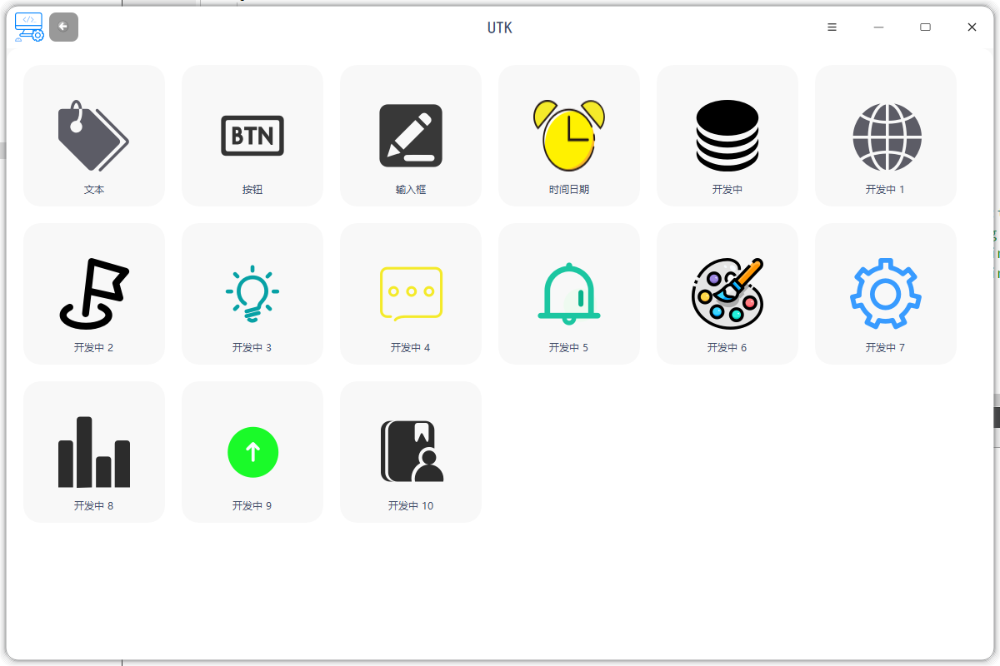
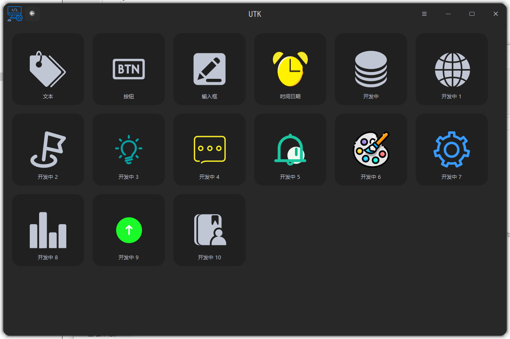
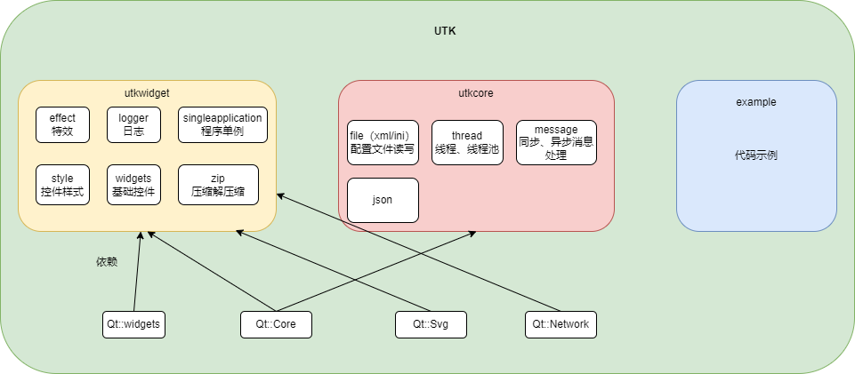

# utkwidget

#### 介绍
UTK(union tool kit)是基于Qt开发的一整套简单且实用的通用开发框架平台，有助于开发者快速进行项目开发，分为utkwidget、utkcore、example三个模块；

utkwidget：
基础控件库，统一样式，颜色，主题风格，支持亮色暗色主题切换，换肤效果，依赖Qt5::Core，Qt5::Widgets，Qt5Svg，Qt5Network模块

utkcore：
提供除UI以外的类的封装，比如：线程，同步，异步消息机制，xml，ini配置文件解析等，只依赖Qt5::Core模块

example：
代码示例，便于开发者快速了解如何使用

软件截图：

#### 软件架构
软件架构说明

#### 安装教程

1.  cmake 3.10 + Qt 5.15.2

#### 开发规范

1.  utkcore和utkwidget两个模块中类名必须以U开头，必须使用Q指针和D指针，私有类、私有成员、私有方法不要在头文件中暴露；
2.  图标规范：深色图标放置目录:/icons/dark/icons/；亮色图标放置目录：/icons/light/icons/；
3.  翻译文件放置在translations目录下且只上传ts文件；
4.  代码中使用颜色首选UPalette类以及颜色枚举，禁止直接用色值；
5.  头文件需要添加注释，方便后续用Doxygen生成文档；
6.  开发过程中需要图标可以到[阿里巴巴矢量图标库](https://www.iconfont.cn/?spm=a313x.search_index.i3.2.19263a81P9idc9)下载；
7.  代码严格按照C++和Qt代码规范进行开发；

#### 使用说明

1.  xxxx
2.  xxxx
3.  xxxx

#### 参与贡献

1.  Fork 本仓库
2.  新建 Feat_xxx 分支
3.  提交代码
4.  新建 Pull Request

#### 特技

1.  使用 Readme\_XXX.md 来支持不同的语言，例如 Readme\_en.md, Readme\_zh.md
2.  Gitee 官方博客 [blog.gitee.com](https://blog.gitee.com)
3.  你可以 [https://gitee.com/explore](https://gitee.com/explore) 这个地址来了解 Gitee 上的优秀开源项目
4.  [GVP](https://gitee.com/gvp) 全称是 Gitee 最有价值开源项目，是综合评定出的优秀开源项目
5.  Gitee 官方提供的使用手册 [https://gitee.com/help](https://gitee.com/help)
6.  Gitee 封面人物是一档用来展示 Gitee 会员风采的栏目 [https://gitee.com/gitee-stars/](https://gitee.com/gitee-stars/)
